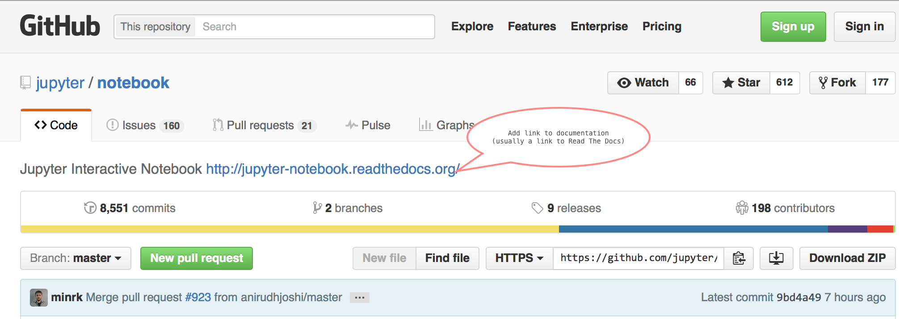

# GitHub Repos and Documentation
## Recommended Structure

Providing users and developers consistency across repos is a valuable time
saver and improves user productivity.

On a larger scope, having the Jupyter name appear prominently in a repo's
README.md file improves the name awareness of Jupyter.

## Recommended Elements in new and existing Jupyter repos

### Repo Description
Please include a link to the documentation in the repo's description.

### Badges after Repo title in README.md
One common way that individuals find documentation is to look for and click
on the doc badge that commonly is found right after the title. Another
benefit is an easy visual indication if the docs are not rendering properly.

### Resources - Common set at the end of README.md

A *Resources* section at the end of the README.md gives useful links and
information to users about the individual project and the larger Project
Jupyter organization.

The *Resources* section includes:

#### Dated: 1-4-2016